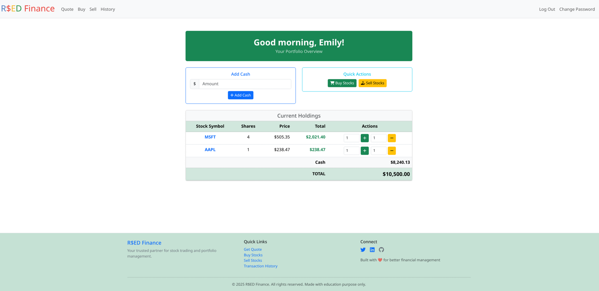

# Enhanced Stock Trading Simulator

A modern web-based stock trading simulator that evolved from a classroom project into a full-featured application showcasing modern web development practices. Practice trading stocks with virtual money while exploring real-time market data.


## 📸 Demo



## 📚 Project Origins & Evolution

This project began as an enhancement of CS50's Finance problem set, where students build a basic stock trading web application. Inspired by the learning opportunity, I transformed the foundational concept into a modern, production-ready application that demonstrates advanced web development techniques.

**What started as a classroom exercise became a showcase of:**
- Modern Python web development with Flask
- Professional database management with SQLAlchemy ORM
- Responsive frontend design with Bootstrap 5
- Dynamic user interactions with JavaScript
- Production-ready development practices

While the original concept of a stock trading simulator came from the CS50 curriculum, the implementation you see here has been rebuilt from the ground up using modern frameworks and best practices.

## ✨ Enhanced Features

### Core Trading Functionality
- **Real-time Stock Quotes** - Live market data via third-party APIs
- **Buy/Sell Operations** - Execute trades with comprehensive validation
- **Portfolio Management** - Dynamic portfolio tracking with live updates
- **Transaction History** - Complete audit trail of all trading activity
- **Cash Management** - Secure fund additions with built-in limits

### Modern User Experience
- **Time-based Greetings** - Personalized welcome messages
- **Responsive Design** - Mobile-first Bootstrap 5 interface
- **Real-time Validation** - Client-side form validation with instant feedback
- **Auto-hiding Notifications** - Elegant flash message system
- **Smart Portfolio Display** - Intelligent filtering and real-time calculations

### Advanced Technical Implementation
- **Database Migrations** - Professional schema management with Flask-Migrate
- **SQLAlchemy ORM** - Modern database operations and relationships
- **Secure Authentication** - Password hashing and session management
- **Error Handling** - Comprehensive exception handling and user feedback
- **API Integration** - Robust external service integration with fallbacks

## 🛠 Technology Stack

**Backend Architecture:**
- **Flask 3.1.2** - Modern Python web framework
- **SQLAlchemy 2.0.43** - Advanced ORM with relationship management
- **Flask-Migrate 4.1.0** - Database migration system
- **Flask-Session 0.8.0** - Secure server-side session handling
- **Werkzeug** - WSGI utilities and security helpers

**Frontend Technologies:**
- **Bootstrap 5** - Modern responsive CSS framework
- **Vanilla JavaScript** - Custom client-side functionality
- **Jinja2** - Advanced templating with custom filters

**Data & APIs:**
- **SQLite** - Development database with migration support
- **Finnhub API** - Professional-grade financial data
- **Environment-based Configuration** - Secure API key management

## 🚀 Installation & Setup

### Prerequisites
- Python 3.8+
- pip package manager
- API key from [Finnhub.io](https://finnhub.io/) (free tier available)

### Quick Start

1. **Clone the repository**
   ```bash
   git clone https://github.com/Redsskull/stock-trading-simulator.git
   cd stock-trading-simulator
   ```

2. **Create virtual environment**
   ```bash
   python -m venv venv
   source venv/bin/activate  # On Windows: venv\Scripts\activate
   ```

3. **Install dependencies**
   ```bash
   pip install -r requirements.txt
   ```

4. **Configure environment variables**
   Create a `.env` file in the project root:
   ```
   FINNHUB_API_KEY=your_finnhub_api_key_here
   SECRET_KEY=your_secret_key_here
   ```

5. **Initialize database**
   ```bash
   flask db init
   flask db migrate -m "Initial migration"
   flask db upgrade
   ```

6. **Launch application**
   ```bash
   python app.py
   ```

7. **Access the application**
   - Navigate to `http://localhost:5000`
   - Register a new account to begin trading

## 💡 Learning Highlights

This project served as a comprehensive learning experience in modern web development:

**Database Design & Management:**
- Migrated from basic SQLite queries to SQLAlchemy ORM
- Implemented proper database migrations for schema changes
- Designed normalized table relationships for transaction tracking

**Frontend Development:**
- Enhanced basic HTML with Bootstrap 5's modern component system
- Added dynamic JavaScript for improved user experience
- Implemented client-side validation and real-time feedback

**API Integration:**
- Researched and integrated modern financial data APIs
- Implemented robust error handling for external service calls
- Designed fallback systems for API failures

**Security & Best Practices:**
- Environment-based configuration management
- Secure password hashing and session handling
- Input validation and SQL injection prevention

## 🗃 Database Schema

### Users Table
- `id` - Primary key (auto-increment)
- `username` - Unique username (indexed)
- `hash` - Secure password hash
- `cash` - Available cash balance (decimal precision)

### Transactions Table
- `id` - Primary key (auto-increment)
- `user_id` - Foreign key reference to users
- `symbol` - Stock ticker symbol
- `shares` - Share quantity (negative for sales)
- `price` - Transaction price per share
- `timestamp` - UTC transaction timestamp

## 🎯 Key Enhancements Over Original

**Modern Development Practices:**
- SQLAlchemy ORM instead of raw SQL queries
- Database migrations for schema management
- Environment-based configuration
- Proper error handling and logging

**Enhanced User Experience:**
- Responsive mobile-first design
- Real-time form validation
- Dynamic content updates
- Personalized user interface elements

**Production-Ready Features:**
- Secure session management
- Comprehensive input validation
- Professional error handling
- Scalable database design

## 🔧 Development Commands

```bash
# Database migrations
flask db migrate -m "Description of changes"
flask db upgrade
flask db downgrade

# Development server
python app.py  # or flask run

# Code formatting (if using)
black app.py models.py helpers.py
```

## 📝 Acknowledgments
This project originated from Harvard's CS50 Introduction to Computer Science course, specifically the Finance problem set. The transformation from a basic classroom exercise into a modern, production-ready application was greatly inspired by Brian Yu's CS50W (Web Programming with Python and JavaScript) lectures, particularly his teachings on:

Django Models & Migrations - Applied these concepts to Flask with SQLAlchemy
Modern JavaScript Techniques - Enhanced user experience with dynamic interactions
Professional Web Development Practices - Database design, security, and project structure

While the core concept of a stock trading simulator came from the CS50 curriculum, this implementation represents a complete modernization influenced by CS50W's advanced web development principles.
Original Concept: CS50's Finance Problem Set
Technical Inspiration: Brian Yu's CS50W lectures on Django and JavaScript
Implementation & Enhancements: Independent development showcasing modern web development practices
The journey from classroom exercise to production-ready application demonstrates the power of taking educational foundations and building upon them with real-world development practices learned from both CS50 and CS50W.

## 📄 License

This project is open source and available under the [MIT License](LICENSE).

---

**Note:** This is an educational project demonstrating web development skills. All trading is simulated with virtual currency and should not be used for actual financial decisions.
